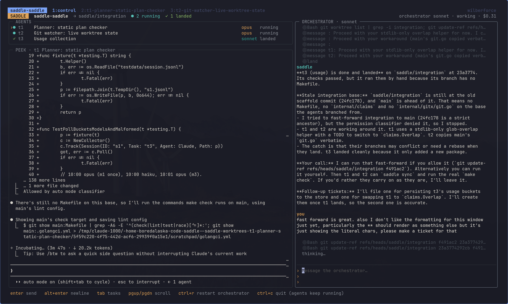

# saddle

Saddle runs a group of coding agents from one terminal. You give it an epic.
It plans a task graph and runs each task as a Claude Code (or Codex or Grok)
agent in its own tmux window and git worktree. It keeps the agents from
colliding, lands their work serially as stacked PRs, and uses a cheap
narrator to tell you what every window is doing.

The goal is that you stop paying Opus to rebase.



*`saddle up` mid-run: three agents (two Opus workers running, one Sonnet task
landed), a live peek at t1's hidden Claude Code terminal, and the Sonnet
orchestrator explaining a stale base and asking before it acts.*

- Design: [TUI canvas](https://claude.ai/artifact/TKRvnLJoDLBonpdKDU19L4)
- Quickstart for a new repo: [docs/QUICKSTART.md](docs/QUICKSTART.md)
- Architecture: [docs/ARCHITECTURE.md](docs/ARCHITECTURE.md)
- Roadmap: GitHub epics, milestone **M0: dogfood**

## Quickstart

```sh
make setup            # dev tools; asks for a Jev key / Claude login only if missing
make install          # puts saddle on your PATH
cd your-repo
saddle init           # asks if you trust the folder, then config, git exclude, ref guard hooks
saddle doctor         # preflight checks, each with a fix
saddle up             # opens the TUI
```

New to Saddle? [docs/QUICKSTART.md](docs/QUICKSTART.md) walks through
install, `make upgrade`, init, doctor, a first epic, holds and auto-merge.

Then talk to the orchestrator in the right-hand chat:

> work on #46 and #47 in parallel

> here's an epic: …, plan it and show me before starting

The orchestrator is a headless Sonnet session. It reads your issues, proposes
a plan with disjoint path claims, and starts Opus workers once you say go.
The workers run Claude Code in a hidden tmux session. You see them as rows in
**AGENTS** and as a live **PEEK** at the selected one's terminal.

You don't babysit them. When an agent hits a prompt, stops without finishing
or conflicts, Saddle hands its screen to the orchestrator. The orchestrator
answers it if that's safe, or tells you in chat what's needed. Finished agents
call `done`. The orchestrator runs the merge train (one branch at a time, so
moved directories are followed and conflicts go back to the agent that wrote
them) and offers stacked PRs that close the issues.

| Key | |
|---|---|
| `enter` / `alt+enter` | send / newline |
| `tab` | switch between chat and the agent list |
| `j` `k` | select an agent (peek follows) |
| `enter` on an agent | open its real terminal; `ctrl-b d` comes back |
| `x` / `L` | kill the agent / land queued branches |
| `ctrl+r` | restart the orchestrator (resumes the conversation) |
| `ctrl+c` | quit. Agents keep running; `saddle up` reconnects |

`saddle down` stops every agent. Worktrees and branches are kept.

Config lives in `.saddle/config.toml` (`saddle init` writes a template):
worker and orchestrator models, concurrency, the test command the merge train
runs, and serial files only the train may touch.

### Orchestrate from Claude Code instead

Saddle also ships as a Claude Code plugin, so your own Claude Code session can
be the orchestrator in place of the TUI's headless Sonnet. With `saddle` on
your PATH:

```
/plugin marketplace add brandonapol/saddle
/plugin install saddle@saddle
```

Then, in a repo where you ran `saddle init`:

> /saddle:orchestrate do #46 and #47 in parallel

The session reads its brief (`saddle plugin brief`), starts
`saddle plugin engine` in the background (the TUI's watchers without the
TUI), plans, spawns workers through the plugin's MCP tools, and keeps a
background `saddle plugin wait` running, which wakes it when an agent needs
something. `/saddle:status` summarizes the agents and the train. The engine
and `saddle up` exclude each other; agents keep running when either stops.
Outside a saddle repo, and inside saddle's own agents, the plugin does
nothing.

Set `harness = "grok"` to run workers and the orchestrator on the [Grok CLI](https://x.ai/cli)
instead of Claude Code. `grok` must be on `PATH` and signed in (`grok login`,
or `XAI_API_KEY`). Workers come up in a tmux window with saddle's hooks and
MCP server installed in that worktree (gitignored). The chat on the right is
one headless grok turn per message, resumed for the rest of the session.
Leave the key unset, or set `harness = "claude"`, to keep Claude Code.

### Under the hood

The TUI uses the same building blocks you can call yourself:
`saddle spawn | status | claim | done | land | sync | prs | message | kill`.

How agents are kept apart:
- Each agent works in its own worktree.
- A Claude Code PreToolUse hook denies writes to files another task has
  claimed, and the denial names the owner. Unclaimed files are claimed on
  first write.
- Notices reach agents through hooks. Inside a worktree, `saddle sync` rebases
  onto everything that has landed.

### Heavy runs: `saddle run`

Parallel agents that all start `flutter test` or `make check` at once
saturate the machine. `saddle run` queues them on one per-user, per-machine
queue that every session and repo shares:

```
saddle run --class go-test [--prio train|worker|background] [--wait-max 30m] -- make check
saddle runq status [--json] | drain [class] | kill <lease> | slots <class> <n>
```

While it waits it prints one line, such as `queued: position 1 of 2 for go-test,
holder t83 (make check, 40s), ~2m`, and then the command runs as if called
directly. It forwards stdin, stdout, signals and the exit code. It starts in
`observe` mode, which records how long runs take but never makes one wait.
To enforce the slots, set `mode = "enforce"` in `~/.config/saddle/runq.toml`
or `.saddle/runq.toml`. `SADDLE_RUNQ=off|observe|enforce` overrides the mode
for one shell. See [docs/runq.md](docs/runq.md).
